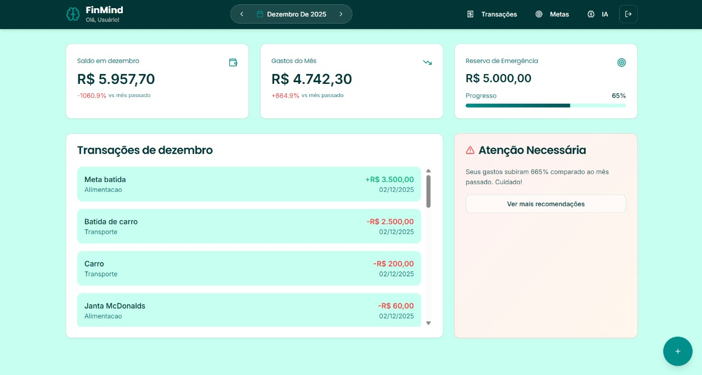

# 🧠 FinMind - Inteligência Financeira Pessoal

> Uma plataforma de gestão financeira moderna que combina controle orçamentário intuitivo com insights gerados por Inteligência Artificial.



## 📋 Sobre o Projeto

O **FinMind** nasceu da necessidade de ir além das planilhas tradicionais. Não é apenas um registrador de gastos, mas um assistente financeiro que utiliza a API do **Google Gemini AI** para analisar padrões de consumo e sugerir otimizações de orçamento em tempo real.

O sistema conta com funcionalidades avançadas como o "Smart Invest", que permite destinar automaticamente uma porcentagem de novas receitas para metas prioritárias, gamificando o processo de poupança.

## 🚀 Funcionalidades Principais

- **Dashboard Interativo:** Visualização clara de saldo, despesas e comparativos mensais (MoM - Month over Month).
- **Gestão de Transações:** Entradas e saídas categorizadas com suporte a datas retroativas.
- **Metas Inteligentes:** Criação de objetivos financeiros com barras de progresso visual.
- **Turbinar Meta (Smart Invest):** Slide deslizante para alocar automaticamente % de ganhos (5%, 10%, 20%...) diretamente para a meta principal.
- **AI Financial Advisor:** Integração com **Google Gemini 1.5 Flash** para consultoria financeira personalizada baseada nos dados do usuário.
- **Modo Offline/Local:** Arquitetura *Local-First* utilizando LocalStorage para persistência rápida e segura de dados.

## 🛠️ Tech Stack

Este projeto foi desenvolvido utilizando as tecnologias mais modernas do ecossistema React:

- **Frontend:** React.js (Vite), TypeScript
- **Estilização:** Tailwind CSS, Shadcn/ui
- **Ícones:** Lucide React
- **IA Generativa:** Google Generative AI SDK
- **Gerenciamento de Estado:** React Hooks & Context
- **Roteamento:** React Router Dom


## 📱 Layout Responsivo
O projeto é totalmente adaptável para dispositivos móveis, contando com um menu de navegação exclusivo e componentes otimizados para touch.

## 🤝 Contato
Desenvolvido por Fabricio Navarro Meira | https://www.linkedin.com/in/fabricio-navarro-meira-214735287/ | scroll.navas@gmail.com


## 📦 Como rodar localmente

Clone o projeto e instale as dependências:

```bash
# Clone o repositório
git clone [https://github.com/SEU_USUARIO/finmind.git](https://github.com/SEU_USUARIO/finmind.git)

# Entre na pasta
cd finmind

# Instale as dependências
npm install

# Configure as variáveis de ambiente
# Crie um arquivo .env na raiz e adicione sua chave do Gemini:
# VITE_GEMINI_KEY=Sua_Chave_Aqui

# Rode o servidor de desenvolvimento
npm run dev
